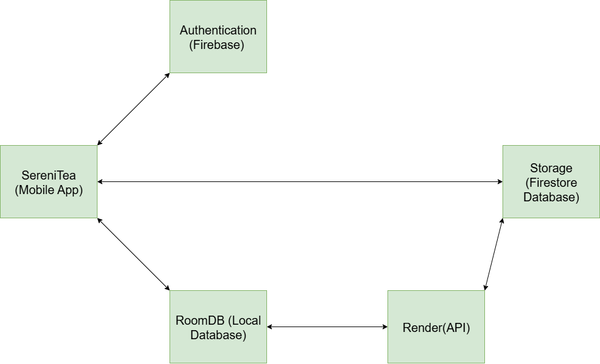

# SereniTeaApp

## App Overview 

The name of my application is SereniTea. This is a self-improvement  application designed to help users cultivate daily habits, tracking personal growth and improve mental wellbeing through tasks that turn into habits. The user will be able to enter the habits that they want to do, tasks that they want to turn itno habits. They will be able to check the list off on a daily basis. The habits will be tracked and displayed back to the user on the trends screen. The application contains habit tracking, mood journaling and motivational prompts. Users can log daily tasks, reflect daily and keep track of their progress. This application will help users to improve their lives in a fun manner. It will help users be aware of where they are currently in their lives. It will show them what they need to improve. This app visualises to the user what their daily life looks like from the mood tracking to the the habit tracking. 

### Current App Features: 

1.	Register and login using single sign-on (SSO)
2.	Setting Changes in the app
3.	Connect to REST API
4.	Habit Tracking
5.	Daily Journaling
6.	Daily Quotes
7.	Trends
8.	Mood Tracking

## Design Considerations

## Changes made
1. I replace the challanges and the challanges tracking with habits. Instead of the users have set challanges to do the user will be able to add their own tasks that they want to turn into habits. These habits will be tracked and sent back to the user to visualize this.
2. The API will only be used for the journals. The Journal aspect of the user will be the only part of the app that will be passed through the API then to Firebase. The image below shows the changes. 
3. I also changed how the trends and the progress will be displayed. I made use of graphs to visualise these two aspects to the user. 

## Utilisation of GitHub and GitHub Actions

I will be utilising GitHub as a means of storage. I will be creating various branches for different aspects of the application and pushing my code to those branches. When i am done with that aspect i will then merge it with the main branches. Here the branches will be tested by the GitHub actions that i will implement. This will ensure that the specific branch runs well and has no errors. It will then allow for a merge with the main branch if there are no errors. GitHub Actions will help with the automated continuos testing to ensure that there are no error or bugs that can cause problems for the main branch

## Own Innovative Features for this part

1. Dark Mode support
2. Mood Tracker
3. Daily Quotes

## References 

GeeksforGeeks. 2024. *Markdown Cheat Sheet*. [Online]. Available at:  
<<https://www.geeksforgeeks.org/html/markdown-cheat-sheet/#escape-characters>>  
[Accessed 29 August 2025].
